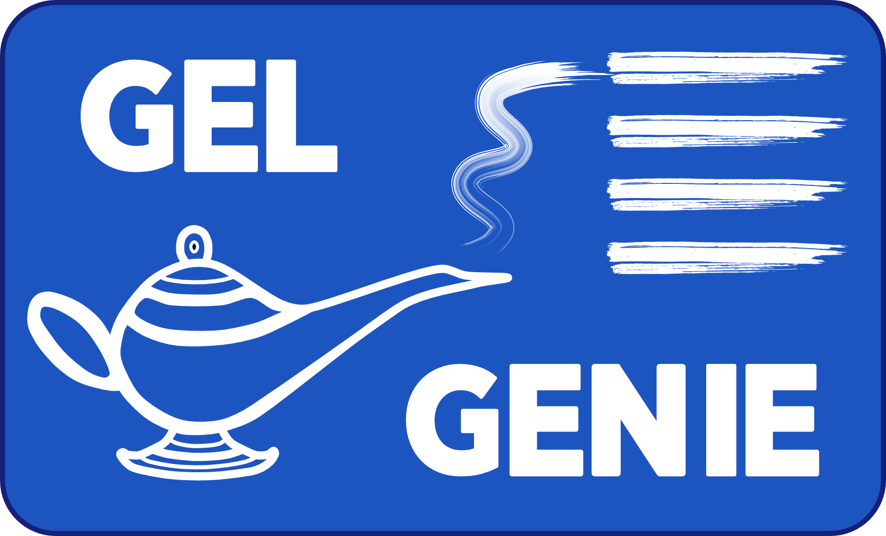
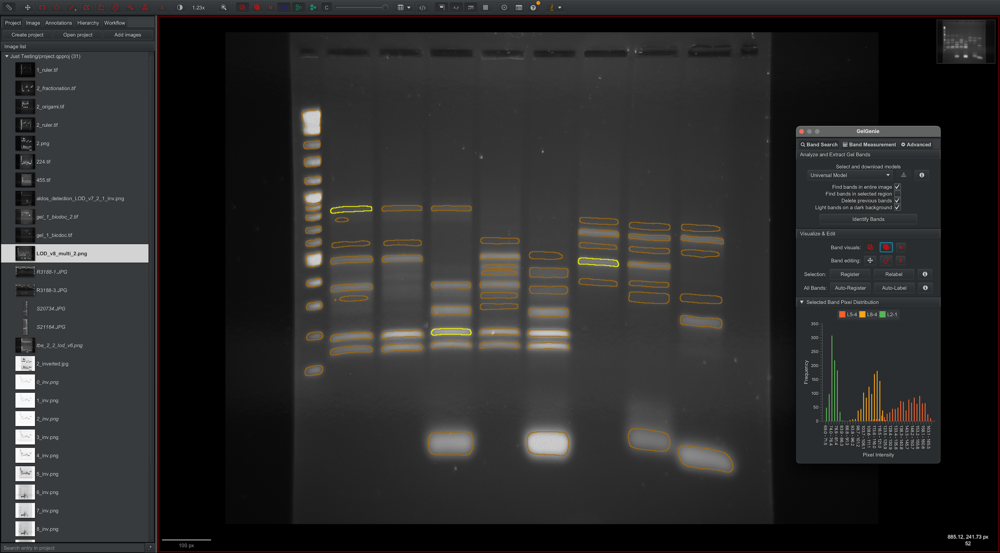
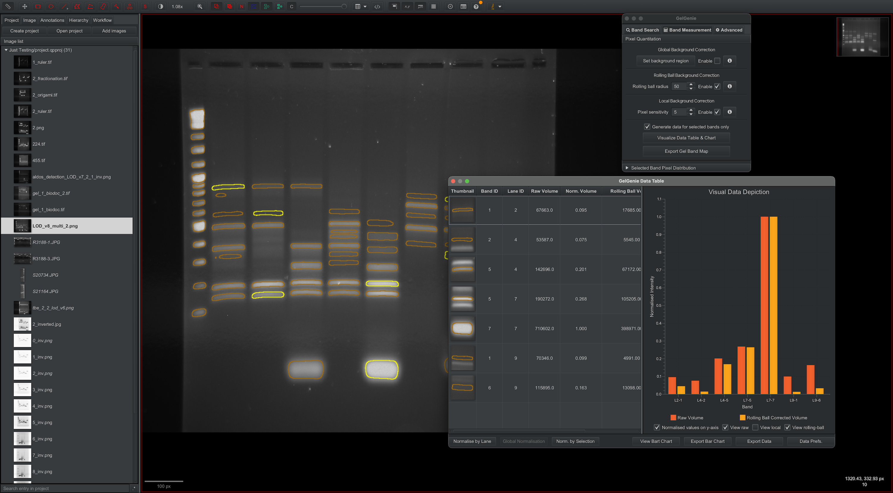
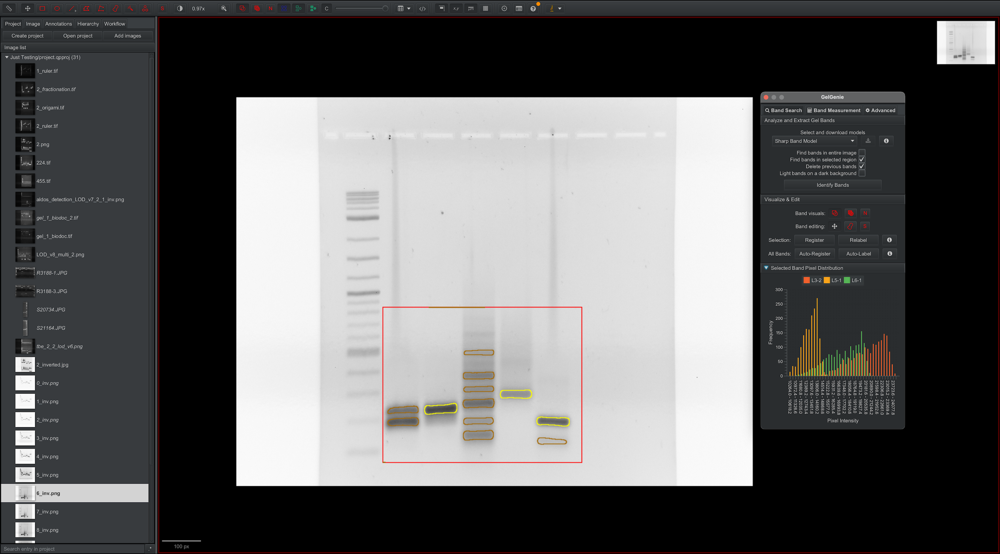
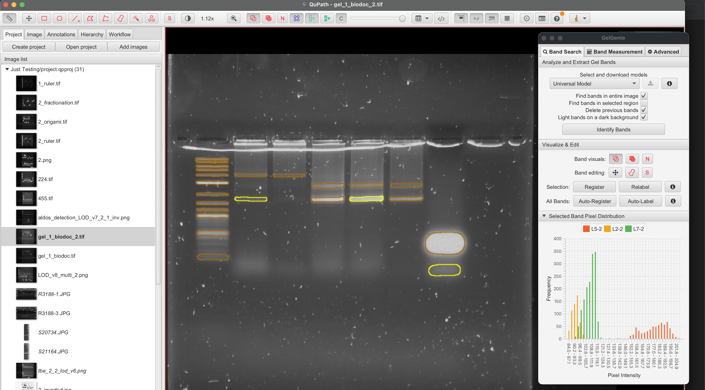
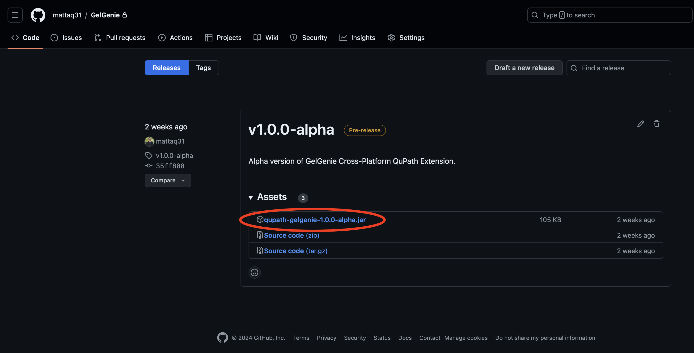
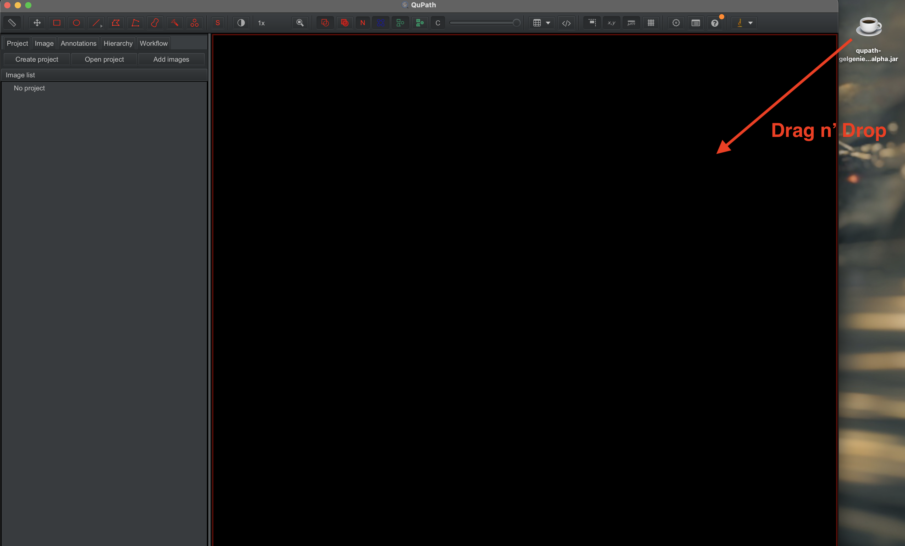
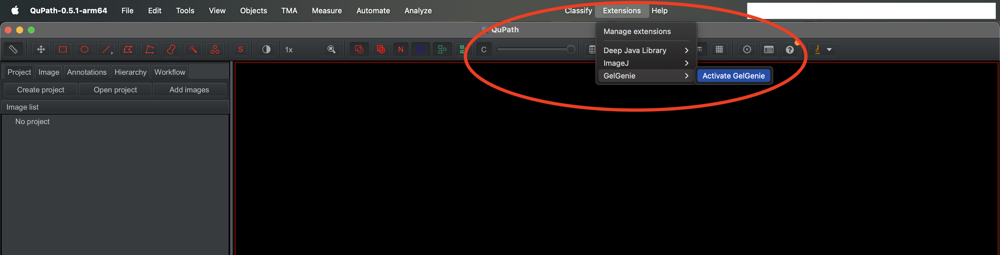

    <picture>
        
    </picture>

    <em>One-click gel electrophoresis analysis.</em>

[![QuPath Extension](https://img.shields.io/badge/QuPath-Extension-blue?logo=data%3Aimage%2Fpng%3Bbase64%2CiVBORw0KGgoAAAANSUhEUgAAABAAAAAQCAMAAAAoLQ9TAAAABGdBTUEAALGPC%2FxhBQAAAAFzUkdCAK7OHOkAAAAgY0hSTQAAeiYAAICEAAD6AAAAgOgAAHUwAADqYAAAOpgAABdwnLpRPAAAApdQTFRFAAAAH0qCa673ETJe%2F%2F%2F%2Fb7T7EDFbZKn2BBAff%2F%2F%2FPXzMaKz6GEBzUpTnVcP%2FQ4PTD06aPH%2FUJV%2BoLmmyBA8cWn2pFTlnN5f%2FAggRFz1uMWqxOnjFQoHRTo%2Fge7%2F%2FAAAAJ12gMW24NXPBNnbFOHfHPX3NRYXWUpTlAAwhJ1yfMW66P3%2FOTo%2Ffm%2Bf%2FIlOQMG24PX3MT5DgEzZiLGWsQYHRVZjrH0yFMW66N3XDR4fYAAAAJFaUP3%2FPAAAEJlmZO3rKS4bSAAAAJFWSOHfFMFiNAAAAHUd8NHG9ES5SLWasMnG%2FLGWtAAACHkd7Pm%2BtdImjCRovIU6GM3C8MjY8kpGPCBcrG0JzKV6hMWy3MW25LGauIVCLAgYMAwMDMzMziIiIAAACDCE8FzpnHUd7HkqAG0R3EjNcAAgXAAAAAAAABQUFNTU1AAAAAgICCAgINHC7PG6tQWaYSHKlOWupOm2vd4qpnpadq6KiwcjOlpKZW2qFNmqsPnW8fH6QrpuUuKWk0NPYwb2%2Bl4B2noyHZWx9Mmeqb4auwbq7mIJ4s6SjvrK0noaAk393kXtzeWNXQFZ1OnK7lZCfwrKwxMDDv7u9nH94lHpyqp%2BflHl0hm5jZWRuNG20QXa6kH1%2Fm4B1xL7Ay8%2FToIaBnH57l398nIWCuLS2gnmANGepQXe%2BjXuAkXlroYyFxcTGwsLFvLm8ubq%2Bvb%2FDs6Sid2VsNWuvOHTAfoOdjndpiXNowLq7zdTYztTXyNHWvcHFkXZtXF1yVIC7f3FtjnpwysrNv7%2FCtbO2v8TJubi7fG9uPGedNXK9WHmplpOcwcXJp52bo5SQqJmXmpmkU3iqM3C8UIPGbYaviJu4iZu4Zn6mQnKxHUFvNnK%2BNXC8%2F%2F%2F%2FYgFKdAAAAG90Uk5TAAAAAAAAAAAAAAAAAAAAAAAAAAAAAAAAAAEPIB8OAQEqg8Pb28F%2FJgNc3dlSAVjt6Eoi08cWb%2F77WQeqkhLBqgMQvaEBBJl3VfXoMxGtoQUuw%2F7WQSia6P383oms%2FtlSCTZrh4RgJwIaovJ%2FHV0R1jkCdQAAAAFiS0dEBI9o2VEAAAAJcEhZcwAACxMAAAsTAQCanBgAAAELSURBVBjTY2AAAkZJKWkZWTkmBghglldQVFJWUVVTZ2EF8dk0NLXyCwqLivO1dXTZGRg4OPX0S0rLyisqq6oNDLm4GXiMjGtq6%2BobGpuaW1pNTHkZ%2BMzM29o7Oru6e3r7%2Bi0s%2BRmsrCdMnDR5ytRp02fMnDXbRoDB1m7O3HnzFyxctHjJ0mXL7R0YHJ1WrFy1es3ades3bNy02dmFwdVty9Zt23fs3LV7z959%2Be6CDEIenvsPHDx0%2BMjRY8dPeHkLM4j4%2BJ48dfrM2XPnL1y85OcvysAgFhCYf%2FnK1WvXbwTdDA5hAbpdPDQsPOLW7cio6JjYuHiQbyQSEpOSU1LT0jMys7IZUEBObh4AnN1fbGkkYr8AAAAldEVYdGRhdGU6Y3JlYXRlADIwMTYtMDktMTFUMTk6MDY6MzUrMDE6MDCMiha4AAAAJXRFWHRkYXRlOm1vZGlmeQAyMDE2LTA5LTExVDE5OjA2OjI3KzAxOjAwpuK%2FswAAAABJRU5ErkJggg%3D%3D)](https://qupath.github.io)

---
Main code repository for GelGenie, an app that uses deep learning models to segment gel electrophoresis images and completely automate the gel analysis process.  The repo is split into two:
- `python-gelgenie` contains a python package for preparing gel image datasets, creating segmentation architectures and training/evaluating deep learning models with PyTorch.  More details on usage and installation in the python package [README](./python-gelgenie/README.md).
- `qupath-gelgenie` contains a QuPath extension that provides an easy-to-access interface for GelGenie models as well as a rich set of tools for analysing and exporting segmentation results.

GelGenie Feature Highlights:
- One-click segmentation of gel electrophoresis images
- General-purpose models that work with a wide range of gel conditions, imagers and stains
- Customisable band measurement, bar chart generation and normalisation
- Easy export to csv for further processing
- Scriptable interface for model inference and labelling
- Python environment for training new models and advanced features
- Open-source and configurable by everyone!

  
  
  
  

## Installing the QuPath GelGenie Extension

- First, install the latest version of QuPath (currently 0.5.1), following the instructions for your operating system [here](https://qupath.github.io).
- Next, download the latest version of the GelGenie extension from the [releases](https://github.com/mattaq31/GelGenie/releases) page (make sure to only download the .jar file):

- Then drag & drop the downloaded .jar file onto the main QuPath window to install it:

- Finally, run GelGenie from the extensions menu:

## QuPath GelGenie Extension Tutorial/Manual

- Watch the video HERE!! for a quick overview of the extension's features.
- For a more comprehensive overview of all available features, read the docs [here](/qupath-gelgenie/README.md).

##  GelGenie's Python Environment and Training New Models (for developers)

Full documentation, Python installation instructions and more details are provided here [Python Quick Start](./python-gelgenie/README.md).
##  Acessing Pre-Trained Models (for developers)

All pre-trained models are available on HuggingFace.  The main registry can be found at the link [here](https://huggingface.co/datasets/mattaq/GelGenie-Model-Zoo/blob/main/registry.json).  The QuPath GelGenie extension directly downloads the models from HuggingFace, with no user tweaking required.

## Accessing Labelled Gel Datasets 

All data can be downloaded in the original format used for training, validation and testing from our Zenodo upload with DOI [10.5281/zenodo.13218469](https://doi.org/10.5281/zenodo.13218469).

## Development & Support
The principal GelGenie researcher and developer is [Matthew Aquilina](https://www.linkedin.com/in/matthewaq/), who built up the concept of gel electrophoresis segmentation and oversaw the project together with [Katherine Dunn](https://www.katherinedunnresearch.eng.ed.ac.uk) at the University of Edinburgh.  The other developers/scientists who contributed to the project are:

- [Nathan Wu](https://nathanw23.github.io) - Gel labelling, lab data generation, data analysis and statistical pipeline development
- [Kiros Kwan](https://www.linkedin.com/in/kiros-kwan/) - Gel labelling, deep learning framework development and model training
- [Filip Buŝić](https://www.linkedin.com/in/filipbusic/) - Image analysis, classical segmentation algorithms and prototype GUI development
- [James Dodd](https://www.linkedin.com/in/james-dodd-b636041ab/) - Gel labelling, lab data generation, prototype testing and feedback
- [Peter Bankhead](https://github.com/petebankhead) - QuPath extension development, deep learning algorithms and java development guidance
- [Alan O'Callaghan](https://github.com/alanocallaghan) - QuPath extension development and java development guiidance
- [Laura Nicolás-Sáenz](https://github.com/lauranicolass) - Clustering algorithm development
- We also received advice, gel data (thanks Arun and Stella!) and alpha testing feedback from other colleagues in both the University of Edinburgh and the Dana-Farber/Wyss Institute for which we are incredibly grateful! 

The project was directly supported by both the [School of Engineering](https://www.eng.ed.ac.uk) (who funded Kiros and Filip) and the [Precision Medicine Doctoral Training Programme](https://www.ed.ac.uk/usher/precision-medicine) at the University of Edinburgh (via Medical Research Council (MRC) grant number MR/N013166/1).  The EDDIE compute cluster (from the Edinburgh Compute and Data Facility ([ECDF](http://www.ecdf.ed.ac.uk/))) was used to train the baseline machine learning models.

For more details of everyone's coding contributions, please check the graphs [here](https://github.com/mattaq31/GelGenie/graphs/contributors).

Contributions from the open-source community are welcome!  In particular, we are looking for help with introducing unit tests to both the Python and Java GelGenie packages!

## Literature Citation
Citation details TBC
