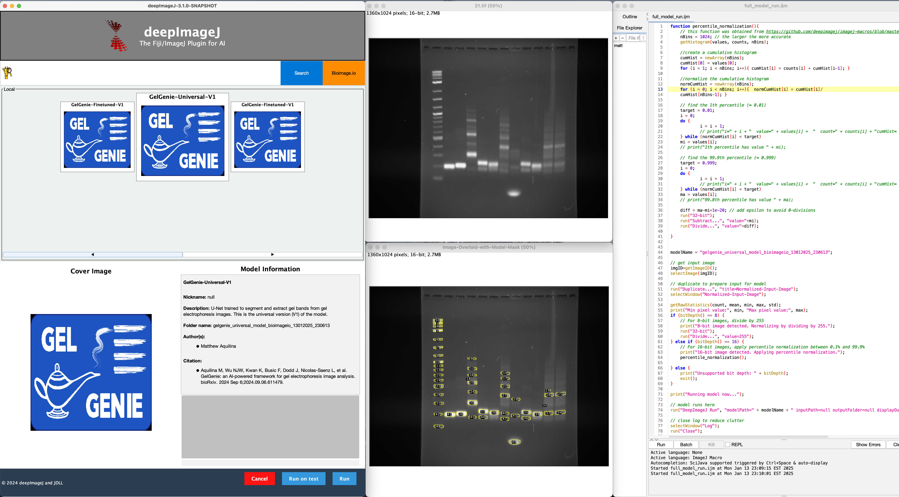

Running BioImage.IO models in Fiji using DeepImageJ
===================================================

- **Disclaimer: We've provided BioImage.IO versions of our main models to allow users to quickly test our models on their data without having to install new software.  However, we highly recommend switching to our GelGenie application to be able to benefit from the main QOL features that are natively provided by QuPath and our own custom software.** 
- To run GelGenie models released in BioImage.IO format, first install Fiji and then install the DeepImageJ plugin (instructions [here](https://deepimagej.github.io)).
- Download a GelGenie model through the BioImage.IO interface within the plugin (link to model will be provided once available).
- Load in your gel image.  Make sure it is a single-channel image (if it's RGB, combine it using ImageJ's standard tools).
- Select your image, then run the `full_model_run.ijm` macro in this folder to pre-process your image, run the model, post-process the results and generate a measurement for each band found in your image. **Make sure to update the `modelName` variable to match the models you have downloaded first!**
- You can also run models directly from the DeepImageJ plugin or adjust our macro as you see fit.  

## Accessing Models Before BioImage.IO Release
- Since model processing on BioImage.IO will take some time, we've provided our models for download here instead:
  - Universal Model: [here](https://huggingface.co/mattaq/GelGenie-Universal-Dec-2023/resolve/main/gelgenie_universal_model_bioimageio.zip)
  - Fine-Tuned Model (Sharp Band Model): [here](https://huggingface.co/mattaq/GelGenie-Universal-FineTune-May-2024/resolve/main/gelgenie_finetuned_model_bioimageio.zip)
- To install in Fiji, download the models, select the `install model manually` option from the DeepImageJ extension toolbar, then point towards the downloaded zip files.  After installation you'll be able to use the model as if it were downloaded from BioImage.IO. 

