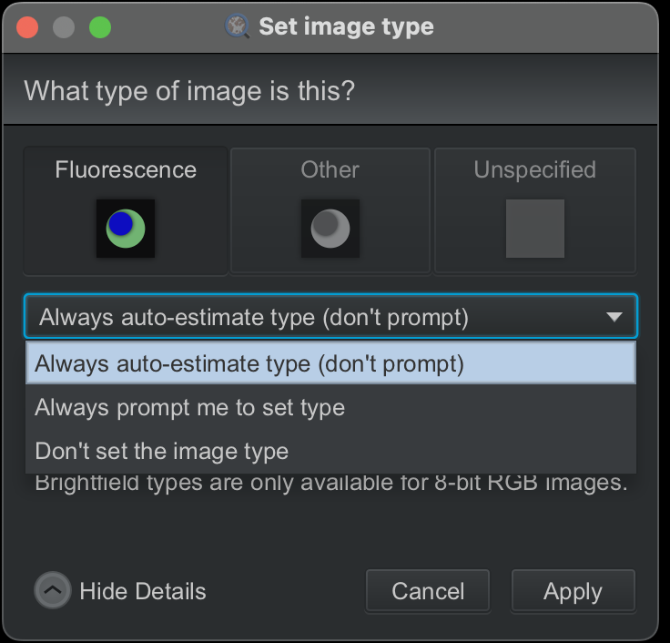
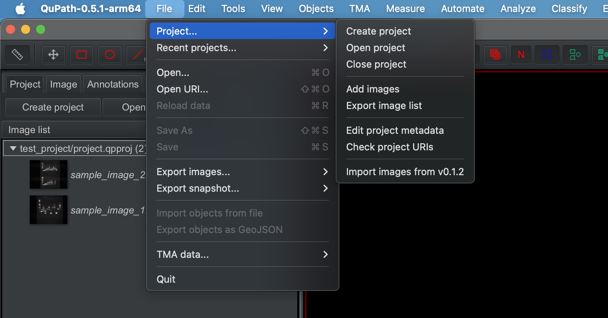
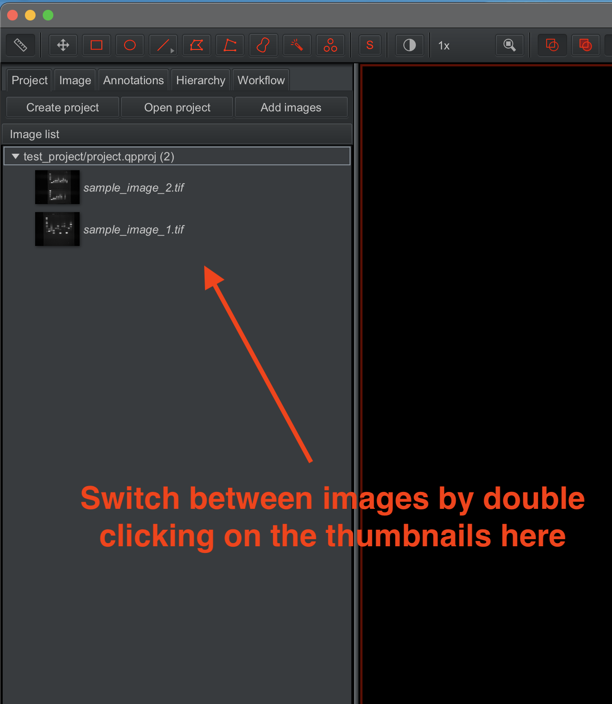
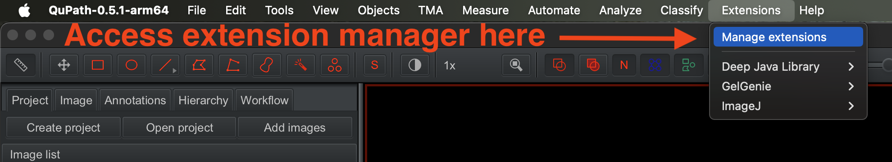
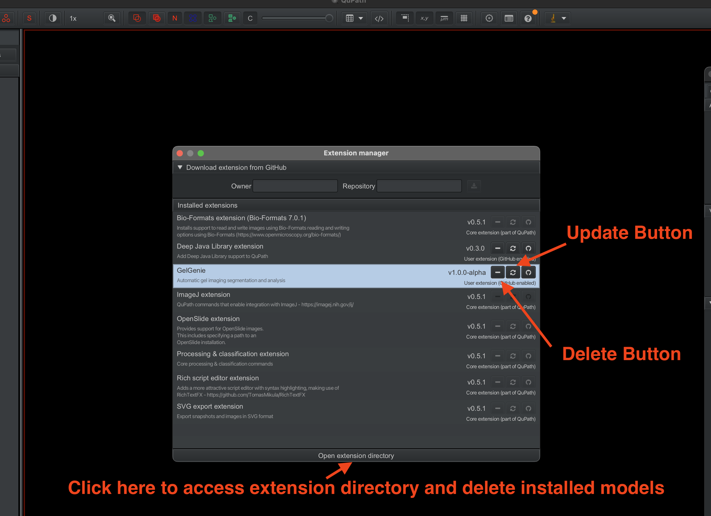

GelGenie QuPath Extension
==============================
The below is meant as a quick-reference guide for all the main features of the GelGenie QuPath extension.  If you are a developer, please browse the source code [here](src/main/java/qupath/ext/gelgenie) for further technical details, or jump to the development mode installation [instructions](#installing-codebase-in-development-mode).
## Installation
Follow the instructions on the main page [here](https://github.com/mattaq31/GelGenie/tree/main?tab=readme-ov-file#installing-the-qupath-gelgenie-extension).
## Opening the Graphical Interface
GelGenie can be opened directly from the QuPath interface by clicking on the Extensions menu and navigating to the `Activate GelGenie` option.

## Loading Images or Creating Projects

The extension can be used in two modes - either by directly loading a temporary image or creating a project.  A project gives you the advantage of having your segmentation results permanently saved in a directory of your choosing.
- For direct image loading, simply drag-and-drop your image into QuPath, in the same way the extension was first installed.  If a prompt is shown asking you to set the image type, feel free to change the setting to `Always auto-estimate type (don't prompt)` (shown below).  GelGenie does not use the image type for any of its operations.  Images loaded in this way are temporary and any segmentations made will be lost when QuPath is closed (unless you choose to save data somewhere).

- To use a project, simply create an empty folder anywhere on your file system, then select the `Create Project` option from the GelGenie interface.  Select the empty folder you just created the deposit your project there.  Any images you now add to the project (drag-and-drop as before) will now be recorded in this project.  This also includes any segmentations you generate.  Please note that the project will **not** save a copy of the underlying image data but simply store a reference to its location.  Deleting the original image data will also cause it to be lost in QuPath (QuPath will prompt you to search for its new location if you've just moved the data and not deleted it).  Best practice is to store your images in a separate (ideally permanent) location.

-  With a project, you can switch between images through the menu on the left, save data at any time and also script operations on all images in your project (more info [here](#scripting)).

## Downloading and Running Models

### Direct CPU Inference (OpenCV Mode)

### Deep Java Library (DJL) GPU Inference

## Editing Band Segmentation

### Adjusting Borders

### Changing Display and Labels

## Band Quantification
### Direct Raw Measurement

### Background Correction

### Results Display

### Exporting Results

## Scripting

## Updating or Deleting the Extension

The extension version you currently have installed can be verified from the Extensions -> manage extensions tool.

To update the extension, simply click on the update button to automatically download the latest release and have it installed.  Make sure to restart QuPath after the update.

To delete the extension, the same extension manager also has a delete button you can use to clear out the extension from your QuPath installation.  To completely delete all models downloaded by GelGenie, you should also click on the `Open extension directory` button and delete the `gelgenie` folder.

## Further QuPath Info
For further tips, tricks and more info on what is achievable within QuPath (alongside the GelGenie extension), please consult the main documentation from [here](https://qupath.github.io).
## Installing Codebase in Development Mode
If interested in adding new features to the extension, the best way to have direct access to the source code and all of QuPath's features is to use [IntelliJ](https://www.jetbrains.com/idea/) as your main IDE.  To start developing, follow the steps outlined [here](https://github.com/qupath/qupath-extension-template#set-up-in-an-ide-optional) to A) download QuPath's source code and B) setup everything in IntelliJ.  Keep in mind the following details:
- The GelGenie extension needs to be in the folder **beside** that of the main QuPath source code to be properly recognized.  To achieve this, first clone the GelGenie repository, and then clone the QuPath repository within the GelGenie folder.  A gitignore statement has already been added to prevent the QuPath repository from conflicting with the GelGenie repository.
- When the above is complete, you can proceed to add the project to IntelliJ as described in the link above.
- Finally, don't forget to add the statement `includeFlat qupath-gelgenie` to the `qupath/settings.gradle` file in the QuPath repository to enable the extension.
- If everything has been setup correctly, you should be able to build QuPath from scratch, with the extension included within it.  You can also use IntelliJ's debug feature to investigate issues and help with development.  
- Keep in mind that QuPath is constantly evolving, and the latest commit on GitHub might contain features not available in the current release.

