GelGenie QuPath Extension Manual
==============================
The below is meant as a quick-reference guide for all the main features of the GelGenie QuPath extension.  If you are a developer, please browse the source code [here](src/main/java/qupath/ext/gelgenie) for further technical details, or jump to the development mode installation [instructions](#installing-codebase-in-development-mode).
## Installation
Follow the instructions on the main page [here](https://github.com/mattaq31/GelGenie/tree/main?tab=readme-ov-file#installing-the-qupath-gelgenie-extension).

## Loading Images or Creating Projects

The extension can be used in two modes - either by directly loading a temporary image or creating a project.  A project gives you the advantage of having your segmentation results permanently saved in a directory of your choosing.
- For direct image loading, simply drag-and-drop your image into QuPath, in the same way the extension was first installed.  If a prompt is shown asking you to set the image type, feel free to change the setting to `Always auto-estimate type (don't prompt)` (shown below).  GelGenie does not use the image type for any of its operations.  Images loaded in this way are temporary and any segmentations made will be lost when QuPath is closed (unless you choose to save data somewhere).

- To use a project, simply create an empty folder anywhere on your file system, then select the `Create Project` option from the GelGenie interface.  Select the empty folder you just created the deposit your project there.  Any images you now add to the project (drag-and-drop as before) will now be recorded in this project.  This also includes any segmentations you generate.  Please note that the project will **not** save a copy of the underlying image data but simply store a reference to its location.  Deleting the original image data will also cause it to be lost in QuPath (QuPath will prompt you to search for its new location if you've just moved the data and not deleted it).  Best practice is to store your images in a separate (ideally permanent) location.

-  With a project, you can switch between images through the menu on the left, save data at any time and also script operations on all images in your project (more info [here](#scripting)).

## Opening the Graphical Interface
GelGenie can be opened directly from the QuPath interface by clicking on the Extensions menu and navigating to the `Activate GelGenie` option.

## Downloading and Running Segmentation Models
To run your first segmentation, follow these steps:
- Load in an image (either directly or through a project).
- Open the GelGenie interface.
- Select a model and download it to your local PC by clicking on the download icon.
  - **The 'Universal Model' is recommended for general-purpose use.**  If results are unsatisfactory, especially with very sharp bands, **the 'Sharp Band Model' is a good alternative.**
  - You can get more info on each model by clicking on the info button next to the download icon.
  - You are free to play around with all the other models available, but most are prototype models that do not offer increased performance in many cases.
  - All `nnUNet` models can only be run with DJL (see below) and are very slow without a GPU.

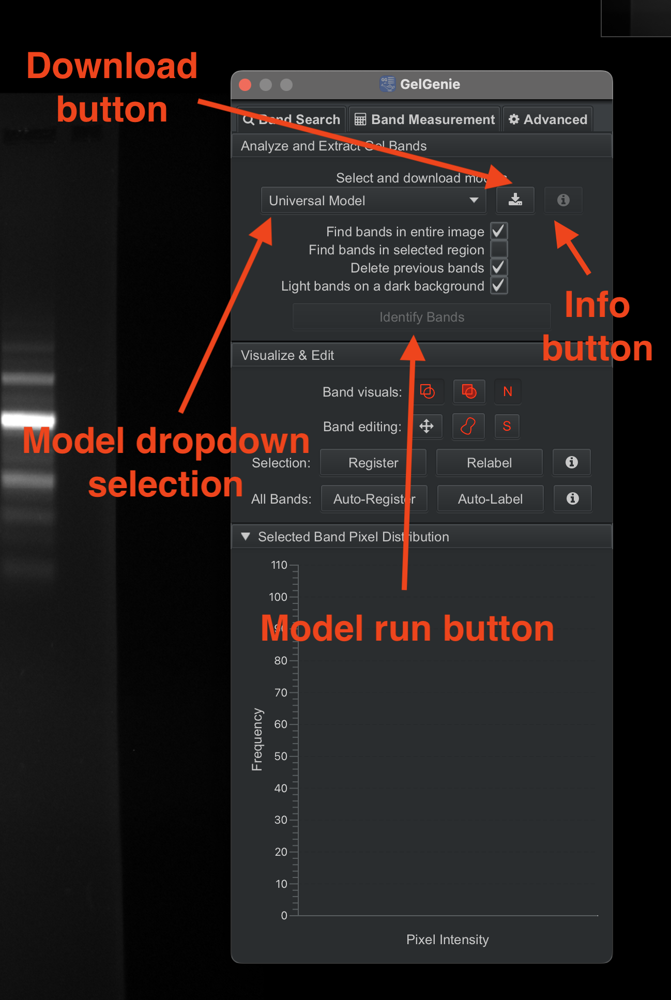

- After clicking the download button, the extension will show a prompt that the model has started downloading.  Once complete, another prompt will be shown.  Please be patient - slow internet connections can take a while to download the models, although in most cases the download should be done in seconds.

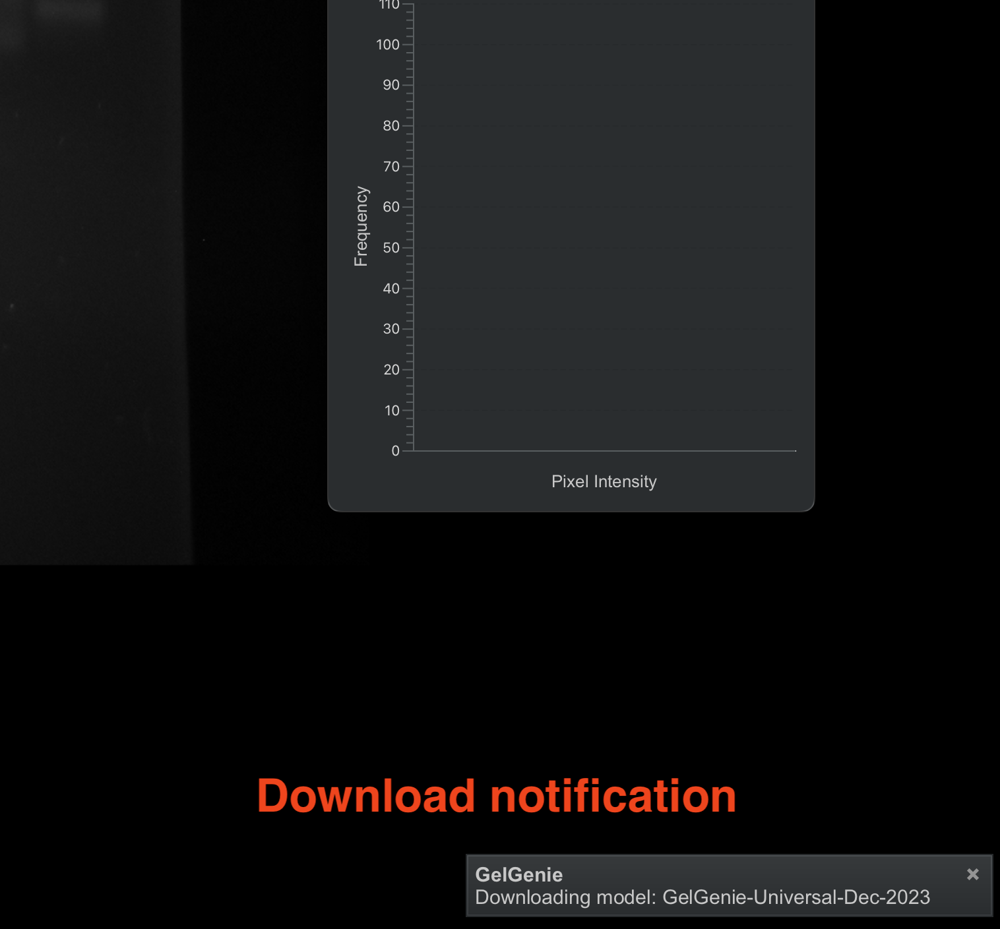
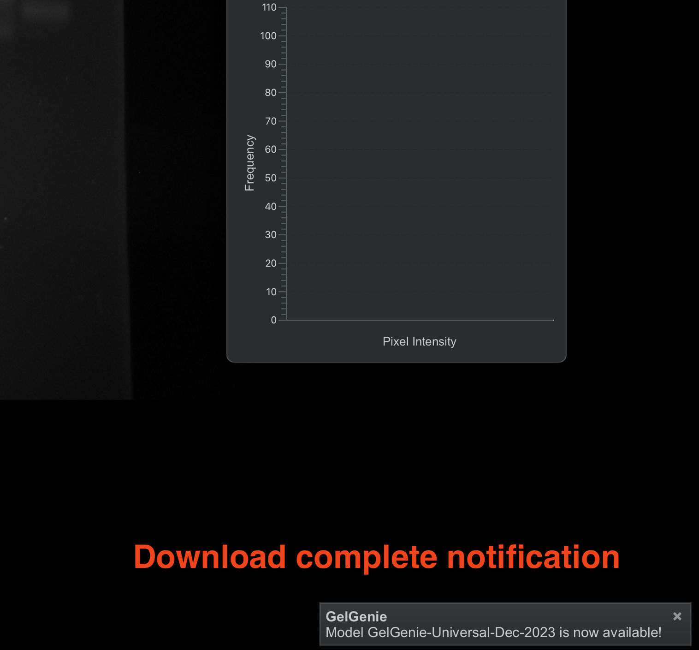

- After the download is complete, the `Identify Bands` button will be enabled. Click on this button to initialize the segmentation process.  There are two paths that can be taken for segmentation, which are explained in the next sections.
- Four checkboxes are available above the `Identify Bands` button.  These can affect the segmentation process as follows:
  - **`Find bands in entire image`** - Selecting this will run segmentation on the entire image (default).
  - **`Find bands in selected region`** - Selecting this will run segmentation only within the selected annotation (more details on annotations [here](#band-segmentation-maps)).
  - **`Delete previous bands`** - Selecting this will delete all previous segmentation results before generating new ones.
  - **`Light bands on dark background`** - Selecting this will assume that bands are lighter than the background (and vice-versa).  The extension will attempt to auto-assign the value of this checkbox but can sometimes make mistakes.  Make sure to fix this setting if it is incorrect for the current image.
- Once a model is downloaded, it is always available for use and an internet connection is no longer required.
- **For advanced users:** The default normalization method for images before being presented to a model is to normalise all pixels to the range 0-1 and cutoff the 0.1% max/min outliers (this normalisation is only used for band segmentation and does not affect quantitation).  However, we have observed that normalizing by the actual datatype max value (e.g. 65535 for 16-bit images) can sometimes have a beneficial effect in 16-bit (or more) images. To use this setting, switch to the `Advanced` tab and toggle between the two checkboxes under `Model Runtime Settings`.  8-bit grayscale images are always normalized by 255, regardless of the values of these checkboxes.
### Direct CPU Inference (OpenCV Mode)
- The easiest way to run models is in direct CPU inference mode using OpenCV, which is the default setting.  
- This mode is fast, requires no preparation and will work well with all systems and models (except `nnUNet` models).
- After clicking on the `Identify Bands` button, GelGenie will show a quick notification that inference has started.  Typically, the process should take just a few seconds on most normal gel images (expect a longer delay for very large .tif images).
- When complete, the segmented bands will be shown directly on the image, as shown below.  Segmentation results can be adjusted and quantified following the guides in the next sections.

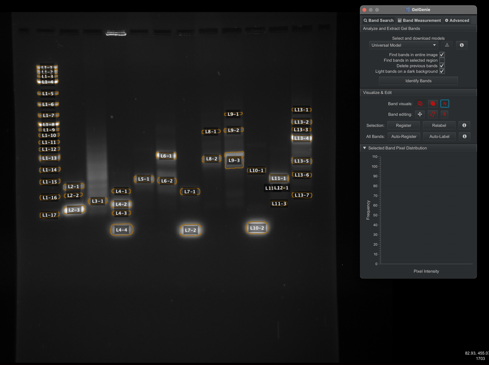

### Deep Java Library (DJL) GPU Inference
- Using DJL requires more setup but allows you to make use of GPUs available on your system to accelerate inference.  Apple Silicon GPUs are also supported (using MPS).
- Before using DJL, you will need to install QuPath's DJL Extension.  This can be done by following the instructions [here](https://github.com/qupath/qupath-extension-djl) (drag-and-drop the jar file in the same way as GelGenie).
- Next, open the DJL extension from the usual extension menu, and select the `Manage DJL engines' option.

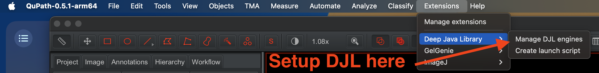

- From the resulting menu, click on the `Check/Download` button to install the PyTorch engine.  Ensure the engine is downloaded properly before moving on.  This step only needs to be done once, after which the engine is permanently available.

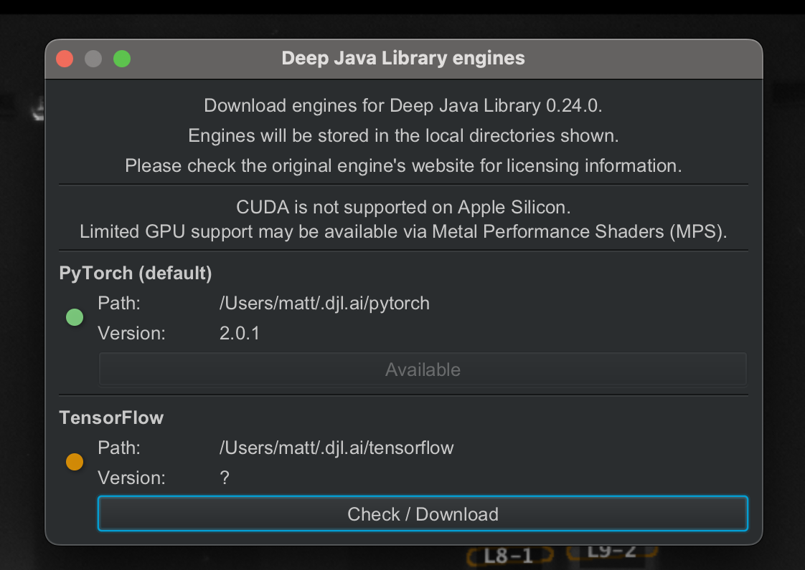

- After the engine is installed, you are now ready to run models using DJL.  To configure GelGenie to use DJL, switch to the `Advanced` tab and check the `Run Models using DJL` checkbox.  To use an available GPU, select it from the dropdown list underneath the DJL checkbox.
- Switching back to the `Band Search` tab will now allow you to use DJL to run inference with the usual `Identify Bands' button.  Keep in mind the following:
  - The first time the GPU is used, there will be a short delay.  Subsequent runs will be much faster.  On an Apple Silicon GPU, typical images are segmented almost instantaneously.
  - You should only run `nnUNet` models in GPU mode, as CPU mode will take a very long time (minutes).
- On restarting GelGenie, make sure to re-enable the DJL checkbox if you wish to use it again.  

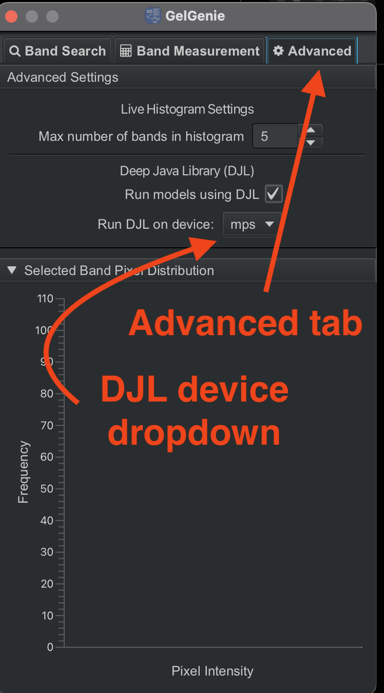

## Band Segmentation Maps

When the selected model has completed the segmentation process, the extension will process its output and generate a single `annotation` for each individual band found.  Annotations are QuPath objects that can be selected, edited and manipulated using QuPath's normal editing tools.  Each annotation represents a single gel band.  When moving on to quantitation, a band's volume is measured by summing the intensity of all pixels within the annotation border.  While the segmentation models are highly accurate in most scenarios, there will be cases where adjusting the model's outputs is necessary.  The following subsections discuss different options for interacting with annotations.

### Changing Band Display

Band colours and visualization options can both be adjusted directly from within GelGenie's `Visualize & Edit` section.  The options available are as follows:
- In the `Band visuals` row, the three icons can be toggled to 1) show/hide bands, 2) fill in bands and 3) display/hide labels, respectively.
- In the `Band editing` row, the three icons can be toggled to 1) turn on/off move mode, 2)  turn on/off brush mode and 3) turn on/off band select mode, respectively.  Band select mode allows you to select multiple bands at once by drawing an annotation shape around them (more info below).

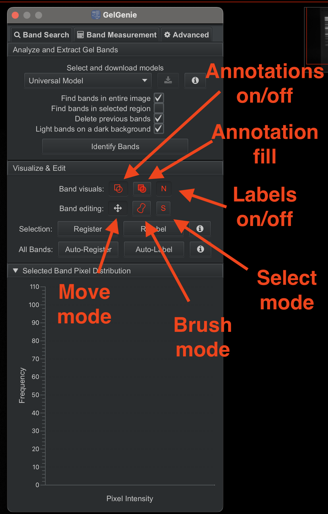

### Adjusting Band Borders

If a model's output segmentation map is incomplete or requires adjustment, changes can be made directly using QuPath's brush tool.  The brush tool can be selected from the main QuPath menu or from within GelGenie's `Visualize & Edit` section (see below).  After  selecting the brush tool, you can extend a band by clicking on its border and dragging the mouse.  If you hold down the `alt` button, the brush tool  becomes an eraser and clicking and dragging on a band will remove the selected regions.  To resize the brush, simply zoom in and out using the mouse wheel (or standard trackpad gestures).  The zoomed-out view in the top right can also be used to help re-position the image quickly.

To exit `brush` mode, simply click on the four-way arrow icon (available in the QuPath menu or in GelGenie's `Visualize & Edit` section).  In this move mode, bands can also be selected and moved around directly.  

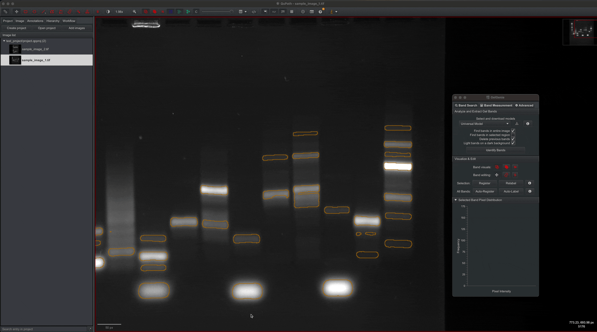

### Manual Band Creation & Label Editing

In other cases, you may wish to create bands entirely from scratch (e.g. when creating a ground-truth segmentation map for model training).  This can be achieved through a combination of methods:
- Bands can be created from scratch using the brush tool as before.  Simply select the brush tool and draw on an empty part of the image to create a new band.
- Annotations created in this way will be default have a red border as they are considered unclassified by QuPath.  To register these annotations as gel bands, simply select the band of interest and then click on the `Register` button.  This should change the annotation's colour to gold (or whichever colour is set as the default band colour).
- Annotations created in this way will have no name/label.  A band's label can be edited by clicking on the band of interest and then clicking on the `Relabel` button.  You can also press the enter key on your keyboard as a shortcut instead.
- To speed-up the segmentation of a large amount of bands, the `Auto-Register` button will register all unclassified annotations as gel bands.  The `Auto-Label` button will automatically assign a label to all bands in the format LX-Y where X = lane number and Y = band number. It will assign lanes/bands from the top left of the image and progress to the far right corner of the image. If your image is not vertically oriented, you will need to rotate it to a vertical orientation for this to work properly (at least in the current implementation).
- The top-left QuPath menu contains various other options for creating different types of annotations, including rectangles, circles and lines.  These can be helpful in certain cases (e.g. defining a background patch or in select mode). 

Info buttons are also provided for the band creation and editing tools, which explain the band creation process directly within the app.

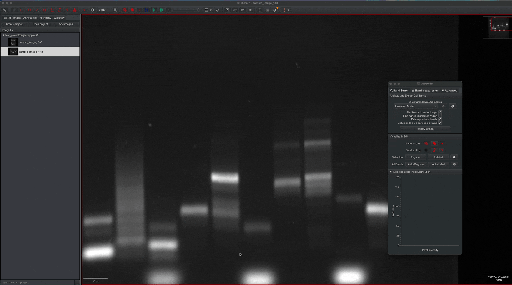

## Band Quantification
When all bands have been segmented and adjusted as necessary, a typical gel workflow involves quantifying the volumes of the bands in the image.  GelGenie's quantitation functionality is contained within the `Band Measurement` tab.
### Direct Raw Measurement
In the simplest case, band measurements can be made by simply calculating the raw volume of each band (summing the intensities of the pixels in each band).  To achieve this for all bands in the image, simply click on the `Visualize Data Table & Chart` button.  This will create a new window containing the data measurements for each band.  

To restrict which bands are included in the data table, select the bands of interest in the image (hold down the ctrl or cmd button to select multiple bands or use the select mode) and then activate the `Generate data for selected bands only` checkbox before generating the data table.

In the standard `Band Search` tab, the bottom `Selected Band Pixel Distribution` section contains a live histogram that shows the pixel intensity distribution of the selected band(s).  This can be useful for quickly comparing the intensities of two bands.  You can adjust how many bands show up at once in this display through the settings in the `Advanced` tab.

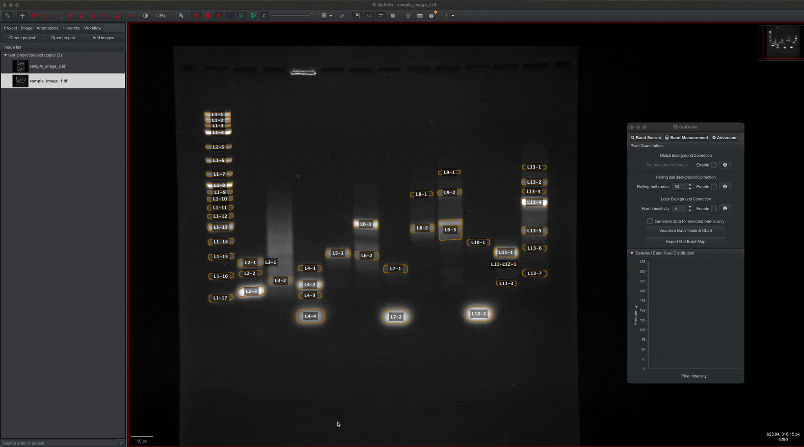

### Results Display, Customization & Export

The results table generated contains various display features:
- Each band in the table is assigned a thumbnail, IDs and various measurements.  Clicking on a data row will also highlight the band in the gel.
- The raw band volume is typically very large and difficult to interpret.  Often, normalised values are significantly easier to use, and GelGenie provides an additional column with normalised values for each band.  The normalised columns values are by default computed globally i.e. the highest volume band in the entire dataset is set to 1 and the lowest volume band is set to 0.  This can be adjusted to either 1) lane normalisation, where all bands are normalised within their specific lane, or 2) normalised with respect to a single specific band, which is set as a value of 1.  The normalisation buttons are in the bottom left of the data table.  To apply the specific band normalisation, first click on the band of interest in the gel image and then click on the `Norm. by Selection` button.
- The `View Bar Chart` button will generate a bar chart comparing all the band values in the table. The display can be toggled to display raw values or normalised values.  When applying background correction (more below), the background corrected values can be displayed next to the raw volumes.  This bar chart can be exported to file using the `Export Bar Chart` button.
- The columns in view can be adjusted through the `Data Prefs.` button.  This will bring up a window which allows you to select/deselect which values you wish to see in the data table.  
- The entire data table can be exported using the `Export Data` button.  The data will be collated into a single csv file and exported to the location of your choice.  The csv file will contain all the columns visible in the data table.
- Multiple data table windows can be created, if desired.
- The segmentation map can be exported as-is with no underlying gel data by clicking on the 'Export Gel Band Map' button.  The image file generated can be used directly for model training, if desired.

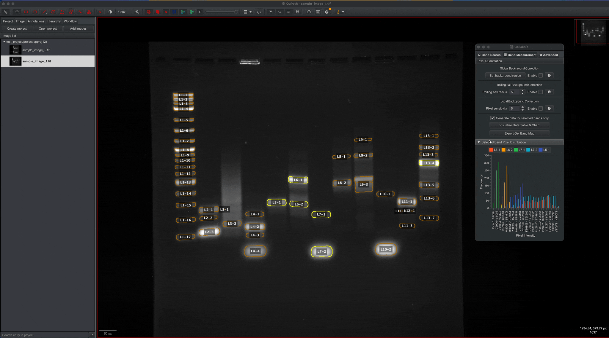

### Background Correction

Often, users prefer to apply background correction in an attempt to remove interference caused by high intensity images or other issues.  GelGenie has 3 types of  background correction built-in.
- **Global Background Correction**: This background correction method works by subtracting a constant 'global' background value from all pixels in your gel bands. The global value is obtained by averaging the intensity of pixels in a user-defined background patch on the gel image. To use this method:
  - Create an annotation covering a background region on your gel. This can be any shape, but creating a rectangle is the simplest method.
  - With the annotation selected, click on the 'Set background region' button to register the annotation as your global background (the annotation will turn blue). 
  - Activate the method's checkbox. 
  - That's it - the result will be automatically computed and added to your results table! 
- **Rolling Ball Background Correction**: This background correction method works by calculating the background for the entire image using ImageJ's implementation of the 'rolling ball' algorithm. This background is then subtracted individually for each pixel in the band of interest. More details can be found here: https://imagej.net/ij/docs/menus/process.html#background. The rolling ball radius can be user-defined but otherwise the method will run automatically (no additional user input is required).
- **Local Background Correction**: This background correction method works by averaging the pixels around each band and using this value as the unique background intensity for each band. The 'Pixel Sensitivity' value defines the radius of pixels to be considered around each band for the local background correction. Generally, 5 seems to be a reasonable value, but choosing the optimal value can be dependent on your gel band spacing and overall gel conditions. Otherwise, the correction system will run automatically - no other user input is required.
- All 3 methods can be used at once by activating/deactivating their individual checkboxes.  The above explanations can all be accessed directly from the app by pressing each method's respective info button. 

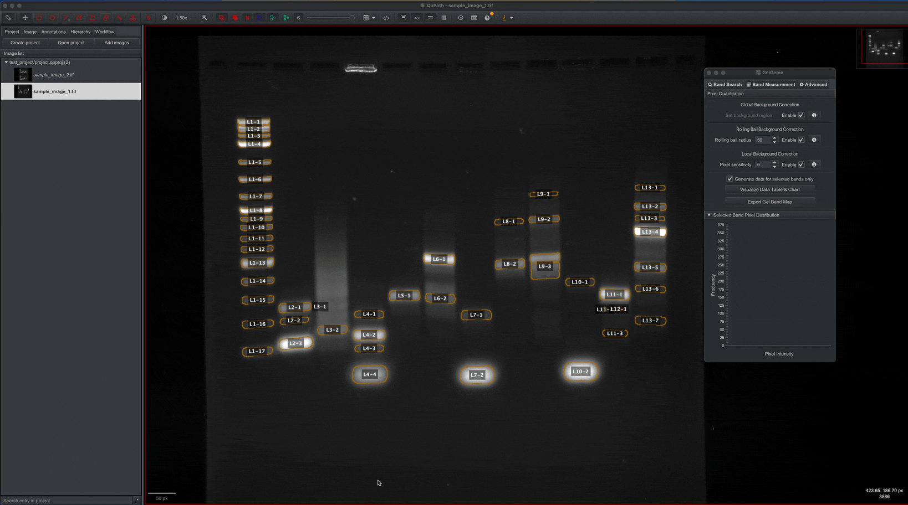

## Scripting

Finally, most of the actions described above can be tracked and eventually scripted.  This is great for replicating a particular workflow for different images, or for processing multiple images in a project at the same time.  QuPath's script editor can be opened from the Automate tab.  However, you can also create a new script containing all the actions you have performed on the selected image from the `Workflow` tab in QuPath.

The `Workflow` tab will hold a record of all operations you've performed on an image (to an extent).  You can convert these operations into a script by clicking on the `Create script` button at the bottom of the tab.   This will open up the script editor with all your previous operations.  You can then edit this script with your preferences and then re-run the analysis on the selected image or other images in the project.  Additionally, by selecting the `Run for Project` option in the hamburger menu next to the `Run` button, the script can be applied for each image in the current project all at once.

The full list of currently available GelGenie-specific scriptable commands and their inputs is provided below:
- `qupath.ext.gelgenie.models.ModelRunner.runFullImageInferenceAndAddAnnotations(MODEL, BOOL-1, BOOL-2, BOOL-3)`
  - Segments an image using the specified segmentation model.
  - MODEL: The model ID to run (e.g. "GelGenie-Universal-Dec-2023").  The exact ID will be provided in the workflow window if a model is run manually first.
  - BOOL-1: Set to `true` to use DJL, set to `false` to use OpenCV.
  - BOOL-2: Set to `true` to invert image before running model.
  - BOOL-3: Set to `true` to normalize non-standard 8-bit images using the datatype maximum (e.g. 65535 for 16-bit images).  Set to false to normalize by the maximum pixel value in the current image instead (this also applies percentile cutoffs and shifts data to the range 0-1).
- `qupath.ext.gelgenie.tools.BandSorter.LabelBands()`
  - Automatically labels all bands in the image using the ladder-band scheme described above. 
- `qupath.ext.gelgenie.ui.TableController.computeAndExportBandData(BOOL-1,BOOL-2,BOOL-3,NORM_TYPE,INT-1,INT-2,BOOL-4,OUTPUT_FOLDER,OUTPUT_FILENAME)`
  - Computes band volume measurement for the selected image and exports it to a csv file. 
  - BOOL-1: Set to `true` to enable global background calculation (requires the background patch to be pre-defined).
  - BOOL-2: Set to `true` to enable local background calculation.
  - BOOL-3: Set to `true` to enable rolling ball background calculation.
  - NORM_TYPE: The type of normalisation to use (only "Global" or "Lane" are supported).
  - INT-1: Pixel sensitivity for local background calculation.
  - INT-2: The radius to use for the rolling ball background subtraction.
  - BOOL-4: Set to `true` if the image needs to be inverted before calculations are made.
  - OUTPUT_FOLDER: The folder to save the output csv file.
  - OUTPUT_FILENAME: The name of the output csv file or `null`, which instructs the script to use the default naming convention.
- `qupath.ext.gelgenie.tools.SegmentationMap.exportSegmentationMapToProjectFolder()`
  - Exports the current segmentation map to the `SegMaps` folder within the current project folder.
## Updating or Deleting the Extension

The extension version you currently have installed can be verified from the Extensions -> manage extensions tool.

To update the extension, simply click on the update button to automatically download the latest release and have it installed.  Make sure to restart QuPath after the update.

To delete the extension, the same extension manager also has a delete button you can use to clear out the extension from your QuPath installation.  To completely delete all models downloaded by GelGenie, you should also click on the `Open extension directory` button and delete the `gelgenie` folder.

## Further QuPath Info
For further tips, tricks and more info on what is achievable within QuPath (alongside the GelGenie extension), please consult the main documentation from [here](https://qupath.github.io).
## Installing Codebase in Development Mode
If interested in adding new features to the extension, the best way to have direct access to the source code and all of QuPath's features is to use [IntelliJ](https://www.jetbrains.com/idea/) as your main IDE.  To start developing, follow the steps outlined [here](https://github.com/qupath/qupath-extension-template#set-up-in-an-ide-optional) to A) download QuPath's source code and B) setup everything in IntelliJ.  Keep in mind the following details:
- The GelGenie extension needs to be in the folder **beside** that of the main QuPath source code to be properly recognized.  To achieve this, first clone the GelGenie repository, and then clone the QuPath repository within the GelGenie folder.  A gitignore statement has already been added to prevent the QuPath repository from conflicting with the GelGenie repository.
- When the above is complete, you can proceed to add the project to IntelliJ as described in the link above.
- Finally, don't forget to add the statement `includeFlat qupath-gelgenie` to the `qupath/settings.gradle` file in the QuPath repository to enable the extension.
- If everything has been setup correctly, you should be able to build QuPath from scratch, with the extension included within it.  You can also use IntelliJ's debug feature to investigate issues and help with development.  
- Keep in mind that QuPath is constantly evolving, and the latest commit on GitHub might contain features not available in the current release.

